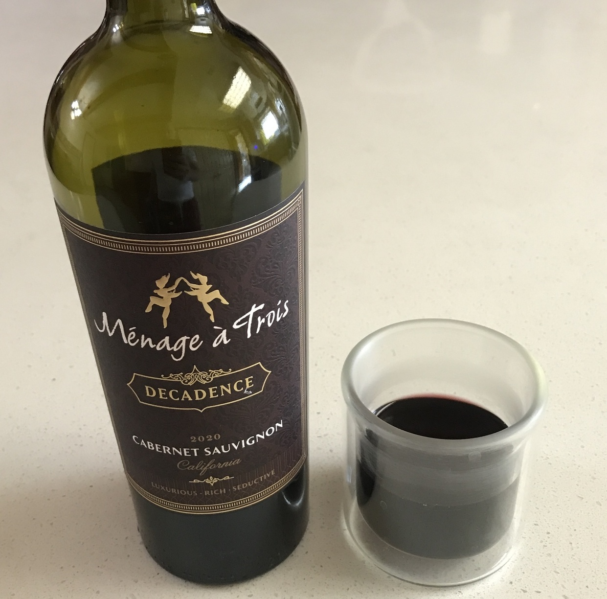

# wine

| name | rating | description | image |
| - | - | - | -  |
| Menage a Trois 2020 Cab Sauv| 4/5 | sweet, berries, tangy, flat, sticky |  |
| Robert Mondavi Merlot 2019 | 3/5 | leathery, dark, quick |  |
| - | - | - | - |
| - | - | - | - |
| - | - | - | - |
| - | - | - | - |
| - | - | - | - |
---

5/5 buy more
4/5 would drink again
3/5 could drink again
2/5 only with something
1/5 no thanks
0/5 no
...
